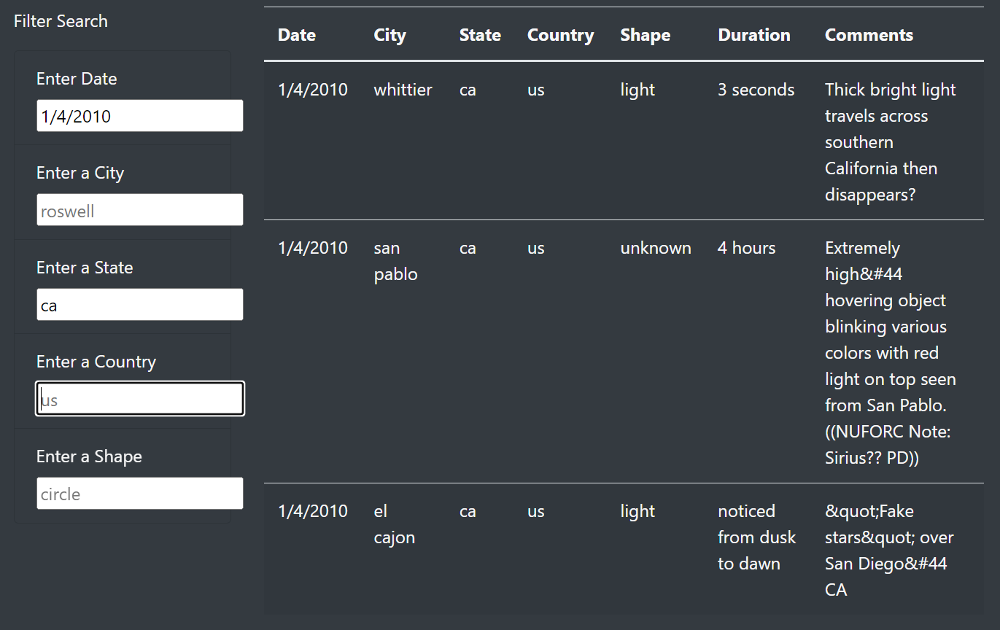
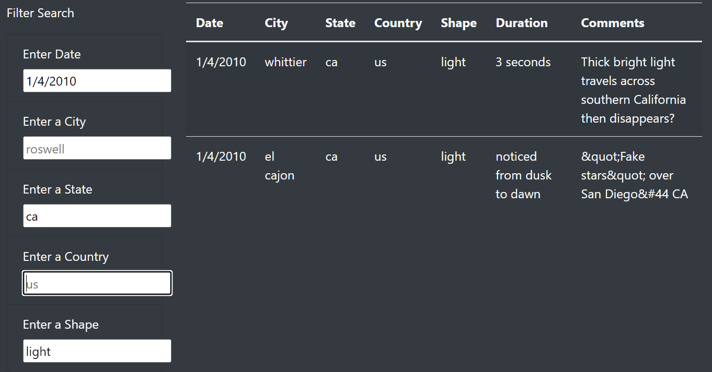
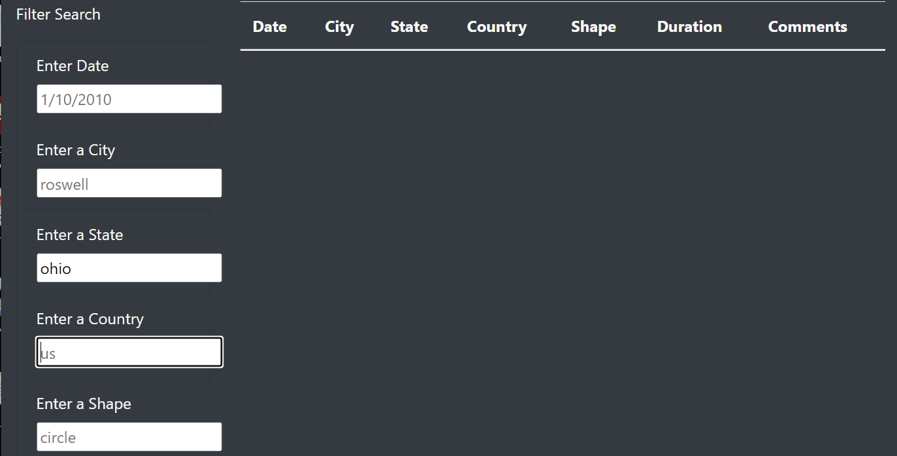

# UFOs
## Project Overview
We are building a dynamic webpage for UFO sightings. This webpage will provide a more in-depth analysis of UFO sightings by allowing users to filter for multiple criteria at the same time. In addition to the date, users will be able to use filters for the city, state, country, and shape. This project will be done using JavaScript and HTML.

## Results
We successfully implemented the HTML webpage in accordance with Dana's requirements. We have taken in the UFO sighting data set. When the page loads, the default view displays all data results.

The data results in this image are unfiltered.

To filter the data, user needs to provide filter criteria in any of the user-input fields provided. 

Filtering data using multiple paramters like the date, state, and then the shape of the UFO sitings in this case:

## Summary
### Drawback

Users are required to enter parameters exactly as they appear in the table data. As shown in image above. Entering data that does not exist within the dataset resulted in an empty return.

### Improvements
  - To address this issue, some code could be written to collect various expected entry formats, translate them into the appropriate table value format in the backend, and provide users with results regardless of whether their parameters were entered correctly.
  - Adding sort feature data columns might also help users. 
  - Expanding date filter to months will help users. User might not know exact date.
